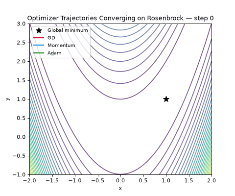

# 🧠 Optimizers for Machine Learning  
### *A Mathematical, Visual, and Conceptual Exploration*

<p align="center">
  
</p>

---

## 📘 Overview

This repository provides an **in-depth, postgraduate-level exploration of optimization algorithms** used in machine learning — from **classical gradient-based methods** to **state-of-the-art curvature-aware optimizers**.

Each notebook blends:
- 🎓 **Rigorous mathematical foundations**
- 📈 **Interactive visualizations**
- 🧩 **Geometric intuitions**
- 💡 **Comparative experiments**

Every notebook is self-contained (no cross-notebook imports) and, wherever a notebook claims an optimizer converges, diverges, or beats a baseline, that claim is backed by a standalone run of the code — not just asserted in prose.

---

## 🧭 Repository Structure

```
ML-Optimization/
│
├── 01_Basics/                                          # 🧩 Foundational Optimization Methods
│   ├── 1_Gradient_Descent.ipynb                        # Gradient Descent (GD) and Stochastic Gradient Descent (SGD).
│   ├── 2_Momentum_and_Nesterov.ipynb                   # Classical Momentum and Nesterov Accelerated Gradient (NAG).
│   ├── 3_Adaptive_methods_adagrad_Adam.ipynb           # Adaptive learning rate methods: AdaGrad, RMSprop, and Adam.
│
├── 02_SOTA_Optimizers/                                 # 🚀 State-of-the-Art (SOTA) Optimizers
│   ├── 1_AdamW_and_Decoupled_Weight_Decay.ipynb        # AdamW and the principle of decoupled weight decay.
│   ├── 2_LION_and_Adamax.ipynb                         # LION (sign-based momentum) and Adamax (∞-norm Adam).
│   ├── 3_RAdam_Lookahead_Ranger.ipynb                  # RAdam (variance rectification), Lookahead, and Ranger.
│
├── 03_Curvature_Aware_Optimizers-1/                    # 🔷 Curvature-Aware (Part I): Foundations of Second-Order Methods
│   ├── 1_Natural_Gradient_Descent.ipynb                # Theory and implementation of Natural Gradient Descent (NGD).
│   ├── 2_K-FAC_from_scratch.ipynb                      # Kronecker-Factored Approximate Curvature (K-FAC), layerwise.
│   ├── 3_Rienmannian_Optimization.ipynb                # Optimization on manifolds: geodesic vs straight-line movement.
│
├── 04_Curvature_Aware_Optimizers-2/                    # 🔶 Curvature-Aware (Part II): Advanced and Practical Methods
│   ├── 1_Newton_and_Levenberg_Marquardt.ipynb          # Newton's method, indefinite-Hessian failure modes, and LM damping.
│   ├── 2_Quasi_Newton_BFGS.ipynb                       # BFGS and L-BFGS curvature approximations from scratch.
│   ├── 3_EKFAC_and_Scaled_Damping.ipynb                # Eigenvalue-Corrected K-FAC and trace-ratio scaled damping.
│   ├── 4_Hessian_Spectrum_Visualization.ipynb          # Exact Hessian spectra, condition number, flat vs. sharp minima.
│
├── 05_Visualizations/                                  # 🎨 Tools and Analysis for Optimization Landscapes
│   ├── 1_Optimization_Landscapes.ipynb                 # Reusable 2D/3D landscape toolkit (Rosenbrock, Rastrigin, Beale, Himmelblau).
│   ├── 2_Loss_Surface_Geometry.ipynb                   # Curvature fields: condition-number heatmaps and eigenvector directions.
│   ├── 3_Convergence_Animations.ipynb                  # Animated GD/Momentum/Adam convergence, exported as GIFs.
│
├── assets/                                             # 🖼 Supporting media for notebooks
│   ├── figures/                                        # Static images and diagrams used in notebooks.
│   ├── gifs/                                           # Animated convergence visualizations.
│
├── requirements.txt                                    # 📦 Python dependencies (NumPy, Matplotlib, PyTorch, ipywidgets, etc.)
└── README.md                                           # 🧾 Main project overview and structure explanation.
```

---

## 🔬 Topics Covered

| Module | Theme | Highlights |
|--------|--------|-------------|
| **01. Gradient-Based Foundations** | Understanding how optimization connects calculus, linear algebra, and geometry. | Gradient Descent, Momentum, Nesterov Accelerated Gradient, AdaGrad, RMSprop, Adam |
| **02. State-of-the-Art Optimizers** | Modern optimizers that dominate deep learning pipelines. | AdamW, LION, Adamax, RAdam, Lookahead, Ranger |
| **03. Curvature-Aware Methods I** | Second-order and quasi-second-order optimizers using curvature information. | Natural Gradient, K-FAC, Riemannian Optimization |
| **04. Curvature-Aware Methods II** | Advanced/practical second-order methods and curvature diagnostics. | Newton / Levenberg–Marquardt, BFGS / L-BFGS, EKFAC, Hessian spectra |
| **05. Visualization & Geometry** | Visual intuition of loss surfaces and optimizer dynamics. | 2D/3D landscape plots, curvature/condition-number fields, convergence animations |

---

## 🧮 Mathematical Depth

Each notebook includes:
- Derivations of update rules  
- Convergence analysis sketches  
- Theoretical connections to optimization theory and information geometry  
- Practical considerations: bias correction, numerical stability, and scaling  

Example snippet from *Natural Gradient Descent*:

```math
θ_{t+1} = θ_t - η F^{-1}(θ_t) ∇_θ L(θ_t)
```

where F(θ) is the Fisher Information Matrix, connecting optimization to information geometry.

A concrete example of the mathematical rigor this repo holds itself to: the original K-FAC notebook shipped with an unused `kl_clip` trust-region parameter, which let the preconditioned step size explode and silently made K-FAC underperform plain SGD/Adam (0.59 vs. 0.99 validation accuracy) despite the surrounding markdown claiming otherwise. That's now fixed (`03_Curvature_Aware_Optimizers-1/2_K-FAC_from_scratch.ipynb`) — K-FAC reaches 1.0 val. accuracy once the trust-region scaling is actually applied. Every notebook added since has been numerically verified the same way before being written up.

---

## 🎨 Visualization Examples

- Optimization trajectories over non-convex surfaces
- Curvature fields: condition-number heatmaps and principal-curvature directions
- Exact Hessian eigenvalue spectra and flat-vs-sharp minima slices
- Animated convergence paths (GD vs. Momentum vs. Adam)

<p align="center">  </p>

---

## 🧠 Learning Outcomes

After working through this repository, you will:
- Understand the mathematical principles of classical, adaptive, and curvature-aware optimizers
- Gain geometric intuition about curvature, conditioning, and step-size adaptation
- Appreciate the trade-offs between efficiency, stability, and generalization
- Be able to prototype, numerically verify, and visualize optimizers in NumPy / PyTorch

---

## 🧰 Tech Stack

- Python 3.11+
- Jupyter Notebooks (Jupyter Lab / Notebook)
- NumPy, SciPy, Matplotlib, SymPy
- PyTorch (autograd-based exact Hessians, e.g. `04_Curvature_Aware_Optimizers-2/4_Hessian_Spectrum_Visualization.ipynb`)
- ipywidgets for interactive, in-notebook hyperparameter exploration
- Pillow (`matplotlib.animation.PillowWriter`) for GIF export in `05_Visualizations/`

---

## Install dependencies:

```bash
python3 -m venv .venv
source .venv/bin/activate
pip install -r requirements.txt
```

---

## 📊 Example Visualization

`05_Visualizations/1_Optimization_Landscapes.ipynb` ships a small reusable toolkit — a `TEST_FUNCTIONS` registry (Rosenbrock, Rastrigin, Beale, Himmelblau) plus `plot_landscape` / `overlay_trajectory` helpers:

```python
fig, ax = plt.subplots(figsize=(7, 6))
plot_landscape('rosenbrock', ax=ax, kind='contour')
overlay_trajectory(ax, path_gd, color='white', label='GD')
overlay_trajectory(ax, path_adam, color='cyan', label='Adam')
ax.legend()
```

---

## 🧩 Suggested Reading
- Goodfellow, Bengio, Courville (2016): Deep Learning — Chapter 8
- Martens & Grosse (2015): Optimizing Neural Networks with Kronecker-Factored Approximate Curvature
- George et al. (2018): Fast Approximate Natural Gradient Descent in a Kronecker-Factored Eigenbasis (EKFAC)
- Kingma & Ba (2015): Adam: A Method for Stochastic Optimization
- Liu et al. (2019): On the Variance of the Adaptive Learning Rate and Beyond (RAdam)
- Zhang & Lucas (2019): Lookahead Optimizer: k steps forward, 1 step back
- Chen et al. (2023): Symbolic Discovery of Optimization Algorithms (LION)
- Pascanu & Bengio (2014): Revisiting Natural Gradient Methods
- Sagun et al. (2017): Empirical Analysis of the Hessian of Over-Parametrized Neural Networks
- Nocedal & Wright (2006): Numerical Optimization — BFGS, L-BFGS, Levenberg–Marquardt

---

## 🚀 Roadmap
- [x] Foundations and classical methods (`01_Basics`)
- [x] SOTA adaptive optimizers (`02_SOTA_Optimizers`)
- [x] Curvature-aware optimizers, Part I: Natural Gradient, K-FAC, Riemannian optimization (`03_Curvature_Aware_Optimizers-1`)
- [x] Curvature-aware optimizers, Part II: Newton/LM, BFGS/L-BFGS, EKFAC, Hessian spectra (`04_Curvature_Aware_Optimizers-2`)
- [x] Landscape/geometry/animation toolkit (`05_Visualizations`)
- [ ] Interactive dashboard (Streamlit) for optimizer comparison
- [ ] Paper summaries and geometric notes

---

## 🧭 Contributing

Contributions are welcome!
If you have new visualizations, mathematical insights, or corrections:
Fork the repository
Create a new branch
Submit a pull request with a clear description

---

## 🧑‍🏫 Author

Agasthya

MLOps Lead — building and maintaining the production ML systems these notebooks explore the theory behind.

---

## 🧾 License
This repository is licensed under the MIT License.
Feel free to use, modify, and cite for academic and educational purposes.

---

## 🌟 Acknowledgements

Special thanks to the open-source and academic communities advancing our understanding of optimization theory and practice.

**"Optimization is not merely about descent — it's about navigating the geometry of intelligence."**
